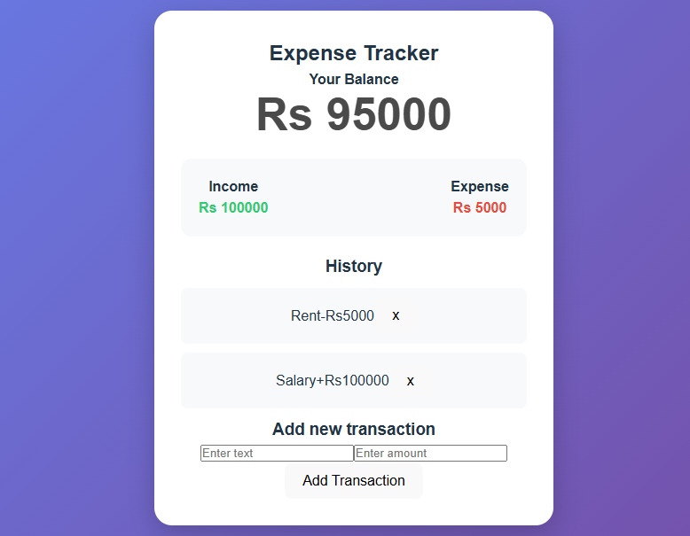

# 💰 Expense Tracker

A responsive **Expense Tracker** web application built with **React.js** — track your income and expenses with real-time balance updates.

---

## 🔗 Live Demo


[👉 Click here to view live](https://expense-tracker-seven-amber-31.vercel.app/)

---

## ✨ Features

- ✅ Add income and expense transactions
- ✅ Real-time balance calculation
- ✅ View transaction history
- ✅ Income vs Expense summary
- ✅ Delete transactions
- ✅ Clean and responsive UI

---

## 🛠️ Technologies Used

| Technology | Purpose |
|------------|---------|
| React.js | Frontend UI |
| Vite | Build Tool |
| CSS3 | Styling |
| React Hooks | State Management |

---

## 📁 Project Structure

```
expense-tracker/
│
├── public/
│   └── vite.svg
│
├── src/
│   ├── assets/
│   ├── components/
│   │   ├── Header.jsx
│   │   ├── Balance.jsx
│   │   ├── IncomeExpense.jsx
│   │   ├── TransactionList.jsx
│   │   ├── TransactionItem.jsx
│   │   └── AddTransaction.jsx
│   ├── App.jsx
│   ├── App.css
│   ├── main.jsx
│   └── index.css
│
├── index.html
├── package.json
├── vite.config.js
└── README.md
```

---
## Screenshot

---

## 🚀 Getting Started

### Prerequisites
- Node.js installed
- npm or yarn

### Installation

**1. Clone the repository:**
```bash
git clone https://github.com/Bushra3895/expense-tracker.git
cd expense-tracker
```

**2. Install dependencies:**
```bash
npm install
```

**3. Run the development server:**
```bash
npm run dev
```

**4. Open in browser:**
```
http://localhost:5173
```

---

## 👩‍💻 Author

**Bushra** — [@Bushra3895](https://github.com/Bushra3895)


This project is open source and available under the [MIT License](LICENSE).
